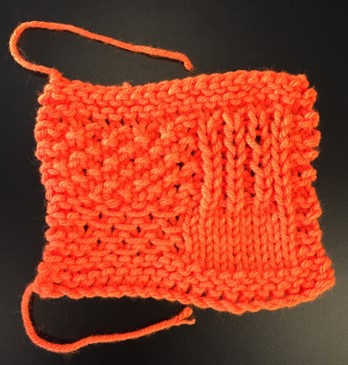

# What is KnitScript?

KnitScript is a computer language that helps you design knitting patterns more easily. In KnitScript, patterns are composed of sub-patterns that let you describe which textures go where and how big those textures should be, instead of working at the level of individual stitch-by-stitch instructions. Of course, you can also define patterns by writing out the stitches row-by-row, so you aren't limited to the textures that come with KnitScript.

This KnitScript program describes a pattern with stockinette stitch, seed stitch, ribbing, and the slipped waves texture in each of the four corners, surrounded by a garter stitch border:

    pattern squares
      fill (slippedWaves, 8, 8), fill (stst, 8, 8).
      fill (seed, 8, 8), fill (rib (1, 1), 8, 8).
    end

    show (standalone (garterBorder (squares, 4, 2)))

Running this program gives you these instructions that you can use to knit the pattern:

> WS: CO 20. (20 sts)  
> \*\*  
> RS: K 20. (20 sts)  
> rep from \*\* 4 times  
> \*\*  
> RS: K 20. (20 sts)  
> WS: K 2, [K, SL] 4, P 8, K 2. (20 sts)  
> RS: K 20. (20 sts)  
> WS: K 2, [SL, K] 4, P 8, K 2. (20 sts)  
> rep from \*\* 2 times  
> \*\*  
> RS: K 2, [K, P] 4, [K, P] 4, K 2. (20 sts)  
> WS: K 2, [P, K] 4, [K, P] 4, K 2. (20 sts)  
> rep from \*\* 4 times  
> \*\*  
> RS: K 20. (20 sts)  
> rep from \*\* 4 times  
> RS: \*BO; rep from \* to end. (0 sts)

And knitting from the instructions gives you this. :)

KnitScript verifies that every pattern is correct. If the pattern runs out of stitches, has too many stitches left over, or uses a stitch incorrectly, KnitScript will tell you what the problem is.

Read the [**KnitScript tutorial**][tutorial] and watch the [**demo video**][demo] to learn more, and download the [**KnitScript editor**](https://github.com/logicologist/knitscript/releases) for Windows or Mac to start creating your own patterns. For more information, see the [**language reference**](https://github.com/logicologist/knitscript/wiki/Language-Reference) page.

# Further Reading

KnitScript started as a student project in the spring of 2019 for [CSE 402][cse402], a class at the University of Washington about domain-specific languages. You can read our reports and poster slides here:

* [Project Proposal][proposal]
* [Design Document][design-doc]
* [Final Report][report]
* [Poster Slides][poster]

KnitScript was inspired by other knitting languages like [Purl](http://chelsea.lol/purl-undergrad/), [KP](http://www.cs.cmu.edu/~taey/pub/knit.pdf) and [Knitting Visualizer](http://www.columbia.edu/~syy2114/knitting-visualizer/).

# Source Code

To run KnitScript using the source code in this repository, you need:

* [Python](https://www.python.org/) 3.7 or later
* [ANTLR](https://www.antlr.org/download.html) 4
    - Either `antlr4` or `antlr` should be in your PATH. This should happen automatically if you install ANTLR using Homebrew on Mac or Chocolatey on Windows.
    - The `antlr4-python3-runtime` package should be installed using pip.

Before running KnitScript for the first time, or after changing the `KnitScript.g4` grammar file, run `python setup.py build`.

To run a KnitScript program, run `python -m knitscript <filename>`. If you run `python setup.py develop`, you can also run KnitScript programs using `knitscript <filename>`.

# License

KnitScript is an open source project that is released under the MIT License.

[proposal]: https://docs.google.com/document/d/1HJaMU6nQh7hZbXyaBIFYdoHr-XjVUfyUXAm2qFd-q9o/edit?usp=sharing
[design-doc]: https://docs.google.com/document/d/1bXGWBJ_lnPc5Xc-QCefcFH5KNZkcsYDslpOo9RWE-is/edit?usp=sharing
[report]: https://docs.google.com/document/d/1aYORpi4gq3Y1R5aTd2yqlDE1VDverKlRFNv3xR3BcdQ/edit?usp=sharing
[poster]: https://drive.google.com/file/d/1F9-DcAWweqWQZeE_HwzfticYpjIXfc7i/view?usp=sharing
[demo]: https://drive.google.com/file/d/1QSRcMQy7tzoCxKIZ2CbPNWYG9alXEeUx/view?usp=sharing
[tutorial]: https://docs.google.com/document/d/1TqBz_DOn-wV0VecZOt3qUNojs47AlXf_VJXSXezxab4/edit?usp=sharing
[cse402]: https://docs.google.com/document/u/1/d/e/2PACX-1vS79XJNWlPB-KISMOiGQEg7RwwNQYnwlU8LV_Chrp7GnE3mQbd1wNCPNqaMkhu0Bmswmu3u8NF5t7Ue/pub